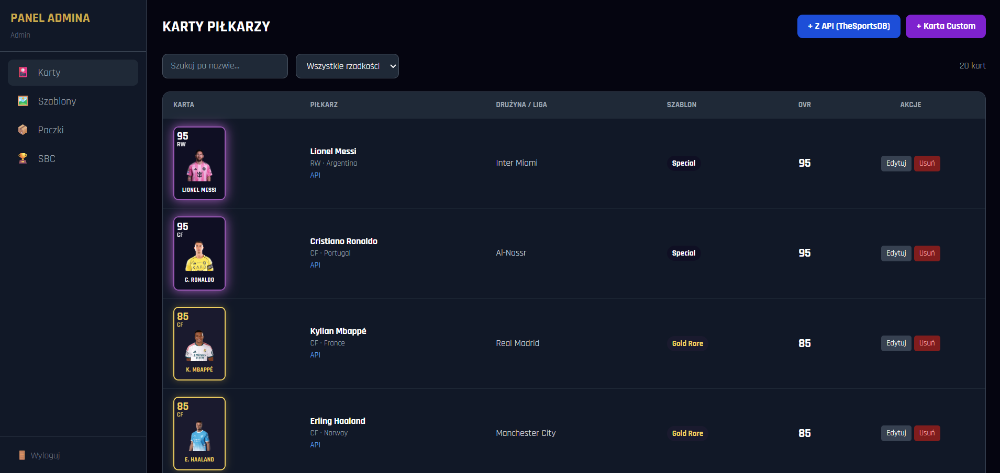
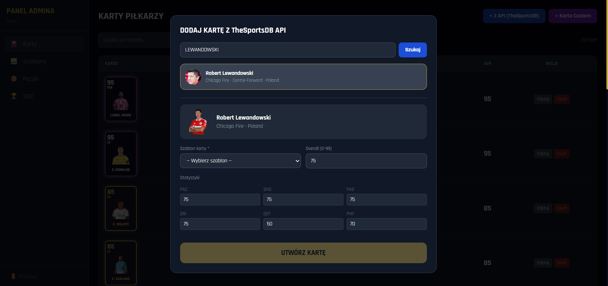
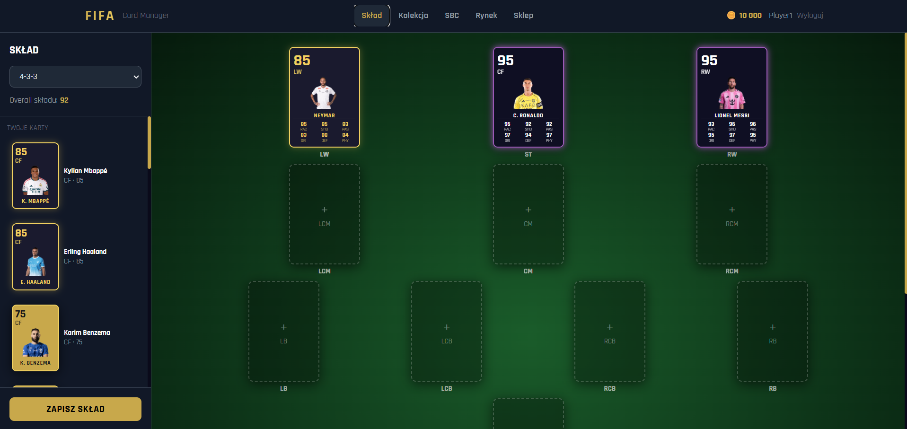
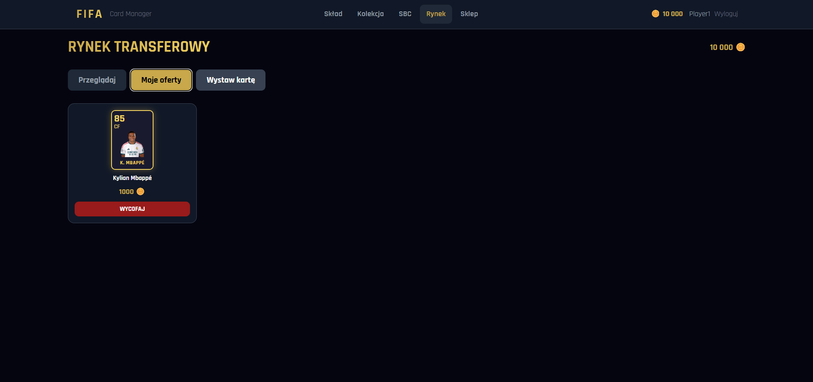

# FIFA Card Manager — AGH Web and Scripting Languages Project

A full-stack football card management application inspired by FIFA Ultimate Team. It is an academic project combining a Vue.js frontend with a Node.js/Express backend and integrates external football data through TheSportsDB API.

## Project overview

The application provides two main user interfaces:

- **Player panel** — allows users to manage their squad, collect player cards, open packs, use the transfer market and complete Squad Building Challenges.
- **Admin panel** — allows administrators to create player cards, manage card templates, packs and SBCs.

Player data is retrieved from an external football API and used to generate collectible cards. Users can also export individual cards as PDF files.

## Project preview

### Admin panel - all cards



### Admin panel - adding card



### Player panel - squad



### Player panel - market



## Project structure

```
fifa-manager/
├── backend/                  # Node.js + Express + SQLite/Sequelize
│   ├── config/                # Database configuration and seed data
│   ├── controllers/           # Business logic for each module
│   ├── middleware/            # Auth (JWT), file upload (Multer)
│   ├── models/                # Modele Sequelize (SQLite tables)
│   ├── routes/                # API endpoint definitions
│   ├── services/               # Services (TheSportsDB API, pack opening logic)
│   └── uploads/                # Images uploaded by the admin (custom cards, template backgrounds)
├── frontend/                  # Vue 3 + TailwindCSS (Vite)
│   └── src/
│       ├── api/                # Axios instance configuration
│       ├── components/cards/   # PlayerCard.vue — card rendering and PDF export
│       ├── router/             # Vue Router and authorization guards
│       ├── store/              # Pinia store for user authentication state
│       └── views/
│           ├── admin/          # Admin panel: cards, templates, packs, SBC
│           └── player/         # Player panel: squad, collection, SBC, market, shop
└── docs/                       # API documentation
```

## Running the project

### Setup

```bash
./start.sh
```

### Backend
```bash
cd backend
npm install
npm run dev
```

### Frontend
```bash
cd frontend
npm install
npm run dev
```

## TheSportsDB API

Base URL: `https://www.thesportsdb.com/api/v1/json/3/`

Key endpoints used in app — `docs/api.md`
